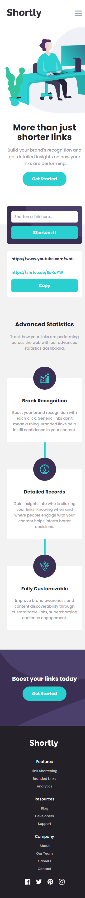
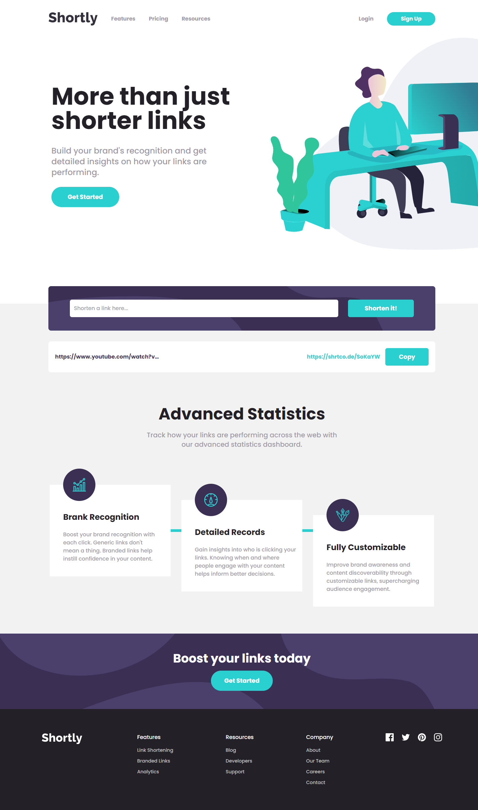

# Frontend Mentor - Shortly URL shortening API Challenge solution

This is a solution to the [Shortly URL shortening API Challenge challenge on Frontend Mentor](https://www.frontendmentor.io/challenges/url-shortening-api-landing-page-2ce3ob-G). Frontend Mentor challenges help you improve your coding skills by building realistic projects.

## Table of contents

- [Overview](#overview)
  - [The challenge](#the-challenge)
  - [Screenshots](#screenshots)
  - [Links](#links)
- [My process](#my-process)
  - [Built with](#built-with)
  - [What I learned](#what-i-learned)
  - [Continued development](#continued-development)
  - [Useful resources](#useful-resources)
- [Author](#author)

## Overview

### The challenge

Users should be able to:

- View the optimal layout for the site depending on their device's screen size
- Shorten any valid URL
- See a list of their shortened links, even after refreshing the browser
- Copy the shortened link to their clipboard in a single click
- Receive an error message when the `form` is submitted if:
  - The `input` field is empty

### Screenshots

> Mobile Preview
> 

> Desktop Preview
> 

### Links

- Solution URL: [https://github.com/Willwf/url-shortening-api-page](https://github.com/Willwf/url-shortening-api-page)
- Live Site URL: [https://url-shortening-api-page.vercel.app/](https://url-shortening-api-page.vercel.app/)

## My process

### Built with

- Semantic HTML5 markup
- Flexbox
- Grid
- Mobile-first workflow
- [React](https://reactjs.org/) - JS library
- [Tailwind](https://tailwindcss.com/) - A utility-first CSS framework
- [Shrtcode](https://shrtco.de/) - The privacy-friendly URL Shortener
- [Vite.js](https://vitejs.dev/) - Bundler JS

### What I learned

This project was very interesting to me because I could fully use tailwind. It helped me understand how powerful it is and how much my knowledge of CSS was important. It was very fun to use it and search ways of doing things. I'm quite very happy with the result.

### Continued development

I intend to continue to advance on the front-end development but I want to try some back-end too. Using the local storage to save my information was not satisfying.

### Useful resources

- [Implementing copy-to-clipboard in React with Clipboard API](https://blog.logrocket.com/implementing-copy-clipboard-react-clipboard-api/) - This is an amazing article which helped me to build a copy button for the project. I'd recommend it to anyone since it also helped me to fixate some react concepts.

## Author

- Github - [William Firmino](https://github.com/Willwf)
- Frontend Mentor - [@Willwf](https://www.frontendmentor.io/profile/Willwf)
- Twitter - [@Williamwf](https://www.twitter.com/Williamwf)
- LinkedIn - [William Firmino](https://www.linkedin.com/in/williamfirmino/)
